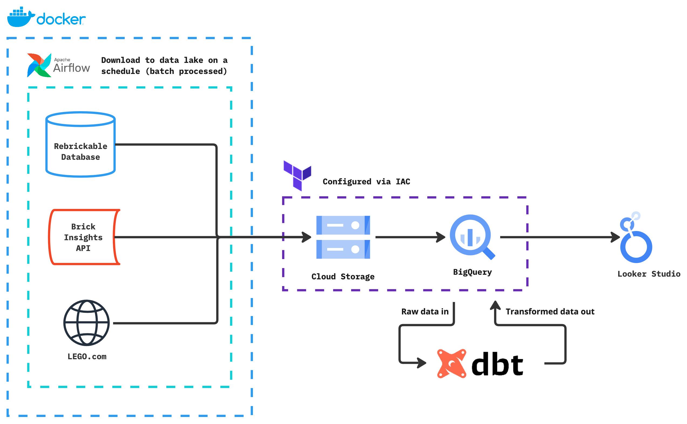

```
   ___                                       __     __                    
 /'___\                                  __ /\ \__ /\ \                   
/\ \__/  __  __    ___       __  __  __ /\_\\ \ ,_\\ \ \___               
\ \ ,__\/\ \/\ \ /' _ `\    /\ \/\ \/\ \\/\ \\ \ \/ \ \  _ `\             
 \ \ \_/\ \ \_\ \/\ \/\ \   \ \ \_/ \_/ \\ \ \\ \ \_ \ \ \ \ \            
  \ \_\  \ \____/\ \_\ \_\   \ \___x___/' \ \_\\ \__\ \ \_\ \_\           
   \/_/   \/___/  \/_/\/_/    \/__//__/    \/_/ \/__/  \/_/\/_/           
 ___                                     __             __                
/\_ \                                   /\ \           /\ \__             
\//\ \       __      __      ___        \_\ \      __  \ \ ,_\     __     
  \ \ \    /'__`\  /'_ `\   / __`\      /'_` \   /'__`\ \ \ \/   /'__`\   
   \_\ \_ /\  __/ /\ \L\ \ /\ \L\ \    /\ \L\ \ /\ \L\.\_\ \ \_ /\ \L\.\_ 
   /\____\\ \____\\ \____ \\ \____/    \ \___,_\\ \__/.\_\\ \__\\ \__/.\_\
   \/____/ \/____/ \/___L\ \\/___/      \/__,_ / \/__/\/_/ \/__/ \/__/\/_/
                     /\____/                                              
                     \_/__/                                               
```

<h1 align="center">Fun with LEGO data</h1>
<p align="center">Data Talks Club Data Engineering ZoomCamp final project  by <a href="https://www.linkedin.com/in/kiliantscherny/"> Kilian Tscherny</a></p>

## Introduction
LEGO is one of my favourite things in the world. I've been playing with it since I was a child and I still enjoy it today. I've always been fascinated by the endless possibilities of building something new and unique with just a few bricks. I also love the idea of reusing and repurposing old bricks to create something new. This is why I chose to work with LEGO data for my final project in the Data Talks Club Data Engineering ZoomCamp.

Even better, there is a large LEGO fan community online and plenty of interesting data about the many products LEGO has released over the years.

## Data
In this project I'm exploring a few different sources of data:
1. Rebrickable's [database](https://rebrickable.com/downloads/) of LEGO sets, parts, themes and more – updated daily and published as CSVs
2. Brick Insights, which offers a [Data Export](https://brickinsights.com/api/sets/export) via an API on interesting information like price, rating, number of reviews and more
3. LEGO's own website, which can be scraped for additional information

### Rebrickable
There are 12 different tables in the Rebrickable database:
| Table | Description |
| --- | --- |
| `themes` | Every LEGO theme – e.g. Star Wars, Racers |
| `colors` | Every colour a LEGO part has been released in |
| `part_categories` | Information about the types of parts – e.g. Plates, Technic Bricks |
| `parts` | The name, number and material of each part |
| `part_relationships` | Details about the relationships between different parts |
| `elements` | The combination of a part and its colour is an element |
| `sets` | Every LEGO set, with set number and name – e.g. 10026-1 Naboo Fighter |
| `minifigs` | LEGO minifigures with name and number |
| `inventories` | Inventories can contain parts, sets and minifigs |
| `inventory_parts` | The parts contained within an inventory |
| `inventory_sets` | The sets contained within an inventory |
| `inventory_minifigs` | The minifigs contained within an inventory |


**See the ERD here to understand the relationships between the tables:**


These are available for direct download as compressed CSV files (`.csv.gz`).

### Brick Insights
Brick Insights offers a Data Export via an API. The data is available in JSON format and can be accessed via a request to `https://brickinsights.com/api/sets/{set_id}`. The returned data includes interesting information like price, rating, number of reviews and more.

```json
{
   "id":19199,
   "set_id":"75575-1",
   "name":"Ilu Discovery",
   "year":"2023",
   "image":"sets/75575-1.jpg",
   "average_rating":"None",
   "review_count":"1",
   "url":"https://brickinsights.com/sets/75575-1",
   "image_urls":{
      "small":"/crop/small/sets/75575-1.jpg",
      "medium":"/crop/medium/sets/75575-1.jpg",
      "large":"/crop/large/sets/75575-1.jpg",
      "teaser":"/crop/teaser/sets/75575-1.jpg",
      "teaser_compact":"/crop/teaser_compact/sets/75575-1.jpg",
      "generic140xn":"/crop/generic140xn/sets/75575-1.jpg",
      "generic200xn":"/crop/generic200xn/sets/75575-1.jpg",
      "genericnx400":"/crop/genericnx400/sets/75575-1.jpg",
      "original":"/crop/original/sets/75575-1.jpg"
   },
   "reviews":[
      {
         "review_url":"https://brickset.com/reviews/set-75575-1",
         "snippet":"None",
         "review_amount":"1",
         "rating_original":"3.9",
         "rating_converted":"78.00",
         "author_name":"None",
         "embed":"None"
      }
   ]
}
```

### LEGO's website
LEGO's [website](https://www.lego.com/en-us) offers a lot of information about their products. This includes general product information, set rating, the price and more. This information can be scraped from the website using a library like BeautifulSoup.

> [!WARNING]  
> Scraping the LEGO website is at your own risk. Your IP address might also be blocked if you scrape too much data in too short a time.

## Project

### [The brief](https://github.com/DataTalksClub/data-engineering-zoomcamp/tree/main/projects#problem-statement)

>**Develop a dashboard with two tiles by:**
>
>- Selecting a dataset of interest (see Datasets)
>- Creating a pipeline for processing this dataset and putting it to a datalake
>- Creating a pipeline for moving the data from the lake to a data warehouse
>- Transforming the data in the data warehouse: prepare it for the dashboard
>- Building a dashboard to visualize the data

### My topic
I'm going to build a dashboard to visualize the data from the Rebrickable database, Brick Insights and LEGO's website.

The dashboard will allow you to easily explore data about LEGO sets, enriched with information about their price, rating and more.

This will empower you to answer questions like:
- Are LEGO sets with more pieces higher rated on average?
- What is the price per element for different sets?
- Which themes have the greatest number of ratings?

And much, much more.

### My approach

1. **Extract (`E`): Airflow & Python scripts**
   - Download the complete Rebrickable database
   - Use the Brick Insights API to get additional information
   - Scrape LEGO's website for more information
2. **Load (`L`): GCP Cloud Storage and BigQuery**
   - Store the extracted data in a data lake
   - Load the data into a data warehouse
3. **Transform (`T`): dbt Cloud**
   - Create a data pipeline for processing the different data sources
   - Clean, test, and document the data to increase its usefulness for analytics
4. **Visualize (`V`): Looker Studio**
   - Connect it to the BigQuery project
   - Build a dashboard to visualize the data




## How to reproduce this project locally

### Prerequisites
> [!CAUTION]
> **You need *all* of the following to recreate this project locally**
- A [Google Cloud](https://cloud.google.com/) account with the necessary permissions and APIs enabled (e.g. service accounts, plus the BigQuery and Cloud Storage APIs – all instructions on how to do this are covered in the [DTC course](https://github.com/DataTalksClub/data-engineering-zoomcamp))
- [Python](https://www.python.org/downloads/) installed on your machine
- [Terraform](https://developer.hashicorp.com/terraform/install) installed on your machine
- [Docker](https://docs.docker.com/engine/install/) installed on your machine
- A [dbt Cloud](https://www.getdbt.com/product/dbt-cloud) account (it's possible to do this with dbt Core, but this is not covered in this project)

### Steps

1. **Clone the repository to your machine**
   ```bash
   git clone
2. **Terraform: to set up the infrastructure (GCP Cloud Storage & BigQuery)**
   - `cd` to the `/infrastructure/` folder
   - Update the following variables in the `variables.tf` file:
       - `project_id` – your GCP project ID
       - `bq_dataset_name` – the name of the BigQuery dataset you want to create where the raw data will be loaded
       - `bucket_name` – the name of the bucket you want to create in Cloud Storage
       - [optionally] the `region` and `location` if you want to change the default values
   - Run `terraform init`, `terraform plan` and `terraform apply` to create the necessary infrastructure
3. **Airflow: to set up the DAGs that Extract and Load the data**
   - `cd` to the `/airflow/` folder
   - Update the following variables in the `docker-compose.yaml` file:
       - `GCP_PROJECT_ID` – your GCP project ID (the same as in the Terraform step)
       - `GCP_GCS_BUCKET` – the name of the bucket you created in Cloud Storage (also the same as in the Terraform step)
   - Run `docker-compose up -d` to start the Airflow webserver and scheduler
   - Open `localhost:8080` in your browser and run the DAGs you want to extract and load the data
   - [optionally] feel free to update the start and end dates (as well as the crontab) of each DAG to suit your needs if you wish to extract and load the data at different times
4. **dbt Cloud: to transform your raw data into something useful**
   - As mentioned above, you will need a dbt Cloud account to do this, but it's perfectly possible to do this with dbt Core (not covered in these instructions, but there are plenty of resources online to help you with this)
   - Connect your BigQuery project to dbt Cloud by following [the guide](https://docs.getdbt.com/guides/bigquery?step=1)
   - When everything is connected, you can execute `dbt build` to run and test the dbt models
   - The transformed data will be stored in a new dataset in BigQuery
5. **Connect your Looker Studio instance to your BigQuery project**
   - Connect your BigQuery project to Looker Studio by following [the guide](https://support.google.com/looker-studio/answer/6370296?hl=en#zippy=%2Cin-this-article)
   - You'll be able to generate insights based on the transformed data in BigQuery